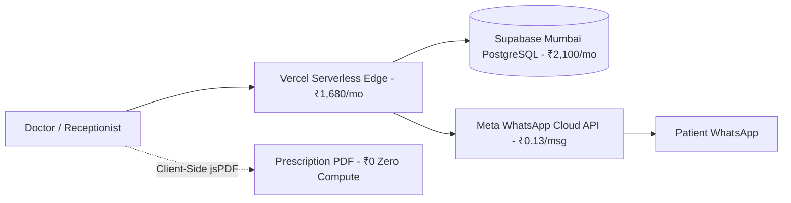

# 💰 RxNXT — Cloud Infrastructure, Operating Cost & Capacity Blueprint
> **A Comprehensive Financial & Scalability Analysis for Running RxNXT in Production**  
> *Currency: Indian Rupee (INR ₹) | Current Architecture: Next.js 14 + Supabase Mumbai + Meta WhatsApp Cloud API*

---

## ⚡ Executive Summary

```text
┌────────────────────────────────────────────────────────────────────────────────────────┐
│  • Pilot Phase (1–5 Clinics):        ₹350 – ₹500 / month     (~₹80 – ₹100 / clinic/mo) │
│  • Commercial Phase (10–30 Clinics):  ₹5,500 – ₹6,500 / month (~₹185 – ₹250 / clinic/mo) │
│  • Scaled Phase (100 Clinics):       ₹16,500 – ₹18,500 / month (~₹165 – ₹185 / clinic/mo)│
│  • Software Gross Profit Margin:     75% to 80% Net Margin on Infrastructure           │
└────────────────────────────────────────────────────────────────────────────────────────┘
```

RxNXT operates on a lean, high-margin serverless infrastructure. By eliminating dedicated servers, running PDF generation client-side, and integrating directly with the **official Meta WhatsApp Cloud API** (bypassing Twilio and third-party aggregators), the cost to host and serve a single clinic is **less than the price of a single outpatient consultation fee per month**.

---

## 📊 Quick Cost & Capacity Matrix

| Dimension | Stage 1: Pilot Testing (1–5 Clinics) | Stage 2: Commercial Launch (10–30 Clinics) | Stage 3: Growth Scale (100 Clinics) |
| :--- | :---: | :---: | :---: |
| **Monthly Consultations** | ~2,500 – 3,500 / mo | ~12,000 – 20,000 / mo | ~60,000 – 80,000 / mo |
| **Active Doctors** | 5 – 15 Doctors | 30 – 80 Doctors | 250 – 400 Doctors |
| **Vercel Hosting & API** | ₹0 *(Hobby)* | ₹1,680 / mo *($20 USD Pro)* | ₹3,360 / mo *($40 USD Pro + Bandwidth)* |
| **Supabase PostgreSQL** | ₹0 *(500 MB Free)* | ₹2,100 / mo *($25 USD Pro)* | ₹4,200 / mo *($50 USD Pro + Compute)* |
| **Meta WhatsApp API** | ₹280 – ₹420 / mo | ₹1,700 – ₹2,600 / mo | ₹8,500 – ₹10,500 / mo |
| **Prescription PDF Engine** | ₹0 *(Client-side jsPDF)* | ₹0 *(Client-side jsPDF)* | ₹0 *(Client-side jsPDF)* |
| **Doctor License Verification** | ₹0 *(Direct NMC API)* | ₹0 *(Direct NMC API)* | ₹0 *(Direct NMC API)* |
| **Domain, SSL & DNS** | ~₹70 / mo *(₹800/yr)* | ~₹70 / mo | ~₹70 / mo |
| **👉 Total Monthly Cost (INR)** | **₹350 – ₹500 / mo** | **₹5,550 – ₹6,450 / mo** | **₹16,130 – ₹18,130 / mo** |
| **👉 Cost Per Clinic / Month** | **~₹80 – ₹100** | **~₹185 – ₹250** | **~₹160 – ₹180** |

---

## 🔍 Detailed Component-by-Component Cost Breakdown



### 1. Web Hosting & Serverless API (Vercel)
* **Architecture**: Next.js 14 App Router, Serverless Functions, Edge Middleware.
* **Pilot (Hobby Tier)**: **₹0**. Ample compute and bandwidth for 5 clinics.
* **Commercial (Pro Tier)**: **$20 / month (~₹1,680 / mo)**.
  * Unlocks production commercial rights.
  * Allows multiple custom cron schedules (Morning 8:00 AM, Afternoon 1:30 PM, Night 8:30 PM).
  * Increases serverless timeout from 15s to up to 300s.

### 2. Database Layer (Supabase Mumbai `ap-south-1`)
* **Architecture**: PostgreSQL managed via Prisma ORM with connection pooling.
* **Pilot (Free Tier)**: **₹0**.
  * 500 MB storage holds **~150,000 complete prescriptions** (each record $\approx$ 2.5 KB).
* **Commercial (Pro Tier)**: **$25 / month (~₹2,100 / mo)**.
  * 8 GB auto-scaling disk storage (capacity: **~3,500,000 prescriptions**).
  * Automated daily backups & Point-in-Time Recovery (PITR).
  * Dedicated connection pooling preventing connection exhaustion during clinic rush hours.

### 3. Messaging & Reminders (Meta WhatsApp Cloud API)
* **Architecture**: Official Meta Graph API v20.0 (`services/whatsappService.ts`).
* **Cost Structure in India**:
  * Free allowance: **1,000 service conversations / month**.
  * Utility Template Messages (Prescriptions, Smart Slot Dose Reminders, Follow-ups): **~₹0.12 to ₹0.14 per message**.
* **Monthly Cost Estimates**:
  * 5 Clinics (~2,500 messages/mo): **~₹325 / month**.
  * 20 Clinics (~15,000 messages/mo): **~₹1,950 / month**.
  * 100 Clinics (~70,000 messages/mo): **~₹9,100 / month**.

### 4. Prescription PDF Engine (`jsPDF`)
* **Cost**: **₹0 (Zero)**.
* **Why**: Renders entirely on the doctor's device (browser DOM). 5,000 doctors generating prescriptions concurrently consumes 0 server compute.

### 5. Medical Council Verification (NMC Service)
* **Cost**: **₹0 (Zero)**.
* **Why**: Direct REST integration with the National Medical Commission & State Medical Council databases.

---

## 📈 Unit Economics & Profit Margins (ROI)

Under the **RxNXT Strategic Pricing Model** (`RxNXT_Strategic_Pricing_Masterplan.md`), pricing is set at **₹9,999 / year per clinic** (~₹833 / month per clinic):

```text
┌─────────────────────────────────────────────────────────────┐
│ 1 Clinic Financial Unit Economics (Monthly)                 │
├─────────────────────────────────────────────────────────────┤
│ Gross Subscription Revenue:              ₹833 / mo          │
│ Less Cloud Hosting & Meta Costs:       - ₹210 / mo (Average)│
├─────────────────────────────────────────────────────────────┤
│ NET GROSS PROFIT PER CLINIC:             ₹623 / mo          │
│ GROSS PROFIT MARGIN:                     74.8%              │
└─────────────────────────────────────────────────────────────┘
```

### Cohort Simulation: 100 Clinics
* **Annual Subscription Revenue** (100 $\times$ ₹9,999): **₹9,99,900 / year** (~₹83,325 / month)
* **Total Annual Cloud & WhatsApp Cost**: **~₹2,04,000 / year** (~₹17,000 / month)
* **Net Annual Infrastructure Profit**: **₹7,95,900 / year (~79.6% Net Margin)**

---

## 🚀 Scalability & Capacity Thresholds

| Component | Current Architecture Limit | What Happens When Reached | Simple Fix / Upgrade |
|---|---|---|---|
| **PDF Generation** | **Unlimited ($\infty$)** | No bottleneck (runs in browser) | None needed |
| **Meta WhatsApp API** | **1,000 unique patients / day** (Tier 1) | Rejects beyond 1,000/day | Auto-scales to **Tier 2 (10,000/day)** after 7 days of verified sending |
| **Morning 8 AM Cron** | **~3,000 reminders / run** (~50 clinics) | Vercel 5-min timeout | Run cron every 10 mins or fan-out via Upstash QStash queue worker |
| **Drug Search API** | **~100 concurrent typing doctors** | Database IOPS spike | Cache drug index in Redis (Upstash) or Edge Memory |
| **Database Storage** | **3,500,000 Prescriptions** (Pro Tier) | Storage reaches 8 GB | Auto-scales storage on Supabase ($0.125/GB) |

---

## 💡 Key Architectural Drivers Behind Low Costs

1. **Direct Meta Cloud API (No Twilio Markup)**:
   * Twilio / third-party aggregators charge **₹0.60 – ₹0.80** per WhatsApp message.
   * Direct Meta Cloud API costs **~₹0.13**. This single decision saves **~₹7,000 to ₹10,000 every month** for every 20 clinics.
2. **Client-Side PDF Generation**:
   * Traditional server-side PDF generation (Puppeteer/Headless Chrome) requires dedicated $40–$80/mo cloud instances.
   * RxNXT uses browser-side `jsPDF`, cutting server compute costs to zero.
3. **Optimized Postgres Queue Locking**:
   * Uses `FOR UPDATE SKIP LOCKED LIMIT 50` for reminders, ensuring zero duplicate messages with minimal database overhead.

---
*Report Generated: 2026-09-08 | RxNXT Cloud Architecture Blueprint*
