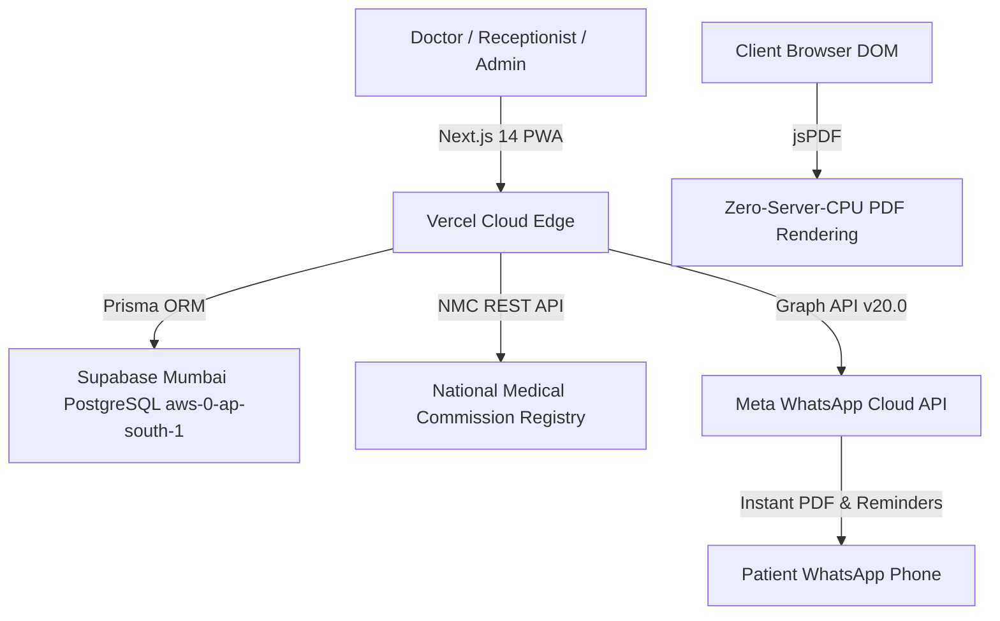
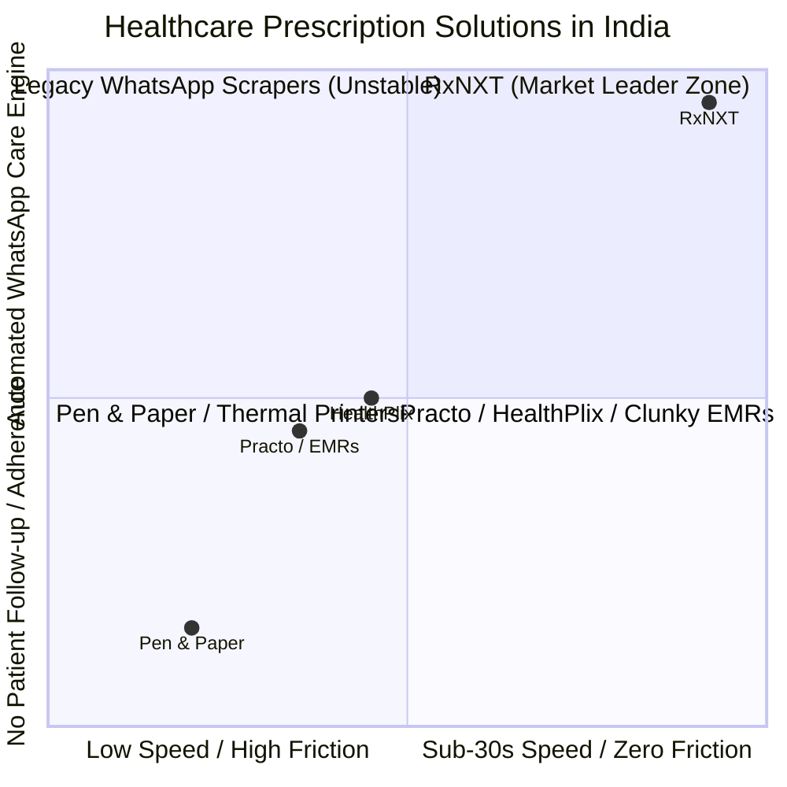
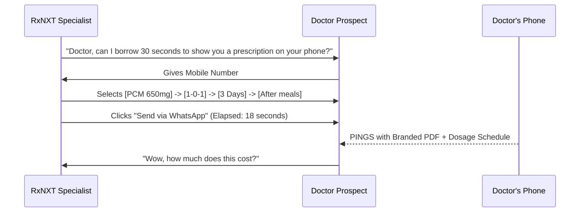

# 🩺 RxNXT — Master Strategic AI Context & Business Bible
> **The Definitive System Prompt, Commercial Blueprint, Clinical Architecture, and Market Analysis Context File for AI-Powered Strategy, Pricing, Sales, Product Roadmap, and Valuation Modeling.**

---

## 📌 How to Use This Document with AI Tools (ChatGPT, Claude, Gemini, DeepSeek, etc.)
**Copy and paste this entire document into any AI tool as background context**, then ask specific questions or assign tasks such as:
- *"Based on this document, create a 30-day cold outreach and field sales script targeting General Physicians in Tier-2 Indian cities."*
- *"Evaluate the feature-to-pricing tiering and propose an upsell strategy for the upcoming Pharmacy and Billing modules."*
- *"Draft a 10-slide angel investor pitch deck with valuation justification for a ₹50 Lakhs seed round."*
- *"Run a sensitivity analysis on our CAC:LTV ratio across 500 onboarded clinics."*
- *"Generate 5 hyper-targeted Meta/Google ad copies targeting busy clinic owners."*

---

# SECTION 1: Executive Summary & Core Identity

| Attribute | Details |
| :--- | :--- |
| **Product Name** | **RxNXT** (Doctor-Led, AI-Enabled OPD Clinical Command Engine) |
| **Tagline** | *"Write a 100% compliant prescription in under 30 seconds; keep patients adherent for life on WhatsApp."* |
| **Parent Company** | **Orug Technologies Private Limited** |
| **Category** | Healthcare SaaS / Clinic Management System (CMS) / Outpatient EMR & Adherence Engine |
| **Target Geography** | Primary: India (Tier-1, Tier-2, Tier-3 cities) \| Secondary: South Asia & MENA |
| **Current Stage** | Cloud-Deployed Production MVP \| Live Meta WhatsApp Cloud API \| Supabase Mumbai PostgreSQL |
| **Core Problem** | 1. Doctors waste 4-6 minutes per patient writing illegible paper prescriptions.<br>2. 60%+ patients forget medicine schedules or lose paper slips within 48 hours.<br>3. Clinics have chaotic walk-in queues and zero automated recall for chronic refills (lost recurring revenue).<br>4. Legacy EMRs (Practo, etc.) are clunky, desktop-bound, and slow down doctors. |
| **Core Solution** | A lightning-fast, mobile/tablet PWA prescription engine that generates structured, legally-verified prescriptions in under 30 seconds and automatically sends branded PDF prescriptions and 3-window Smart Slot WhatsApp dosage reminders directly to the patient. |

---

# SECTION 2: Technical Architecture & Infrastructure Economics



### 1. The Modern Stack
- **Frontend & App Framework:** Next.js 14 (App Router), TypeScript, Tailwind CSS, Radix UI primitives, Lucide icons.
- **Form Factor:** Mobile-first Progressive Web App (PWA) with native iOS/Android standalone home-screen installation and sticky bottom action footers.
- **Database & Multi-Tenancy:** PostgreSQL on Supabase Mumbai (`ap-south-1`) via Prisma ORM. Strict multi-tenant isolation keyed by `clinicId`.
- **Search Engine:** Fuse.js fuzzy engine with custom **Additive Clinical Scoring Algorithm**:
  - Exact Alias Match (e.g., `"PCM"` $\rightarrow$ Paracetamol 650mg): **+100 pts**
  - Doctor Historical Preference: **+50 pts**
  - Clinic Formulary Standardization: **+20 pts**
  - Search latency: **< 15ms**.
- **Prescription PDF Engine:** Client-side `jsPDF` rendering. Eliminates server-side rendering latency and server CPU costs ($0.00 server cost for rendering 100,000 PDFs).
- **Patient Messaging Gateway:** Official **Meta WhatsApp Cloud API (Graph API v20.0)**. Zero third-party scrapers (no Twilio, no Baileys). Direct server-to-server messaging with approved Utility templates (`rxnxt_prescription_doc`, `rxnxt_dose_reminder`, `rxnxt_followup_reminder`, `rxnxt_refill_reminder`).
- **Doctor Verification:** Direct integration with the National Medical Commission (NMC) REST API (`services/doctorVerificationService.ts`), validating Indian Medical Registry records across 24+ State Medical Councils in ~0.4s.

### 2. Infrastructure Unit Cost
- **Hosting (Vercel Serverless):** ₹0 to ₹1,600/month (handles 50,000+ API calls/month within standard tier).
- **Database (Supabase PostgreSQL):** ₹0 to ₹2,100/month (supports up to 500,000 patient records).
- **Meta WhatsApp Cloud API:** Utility template conversations charged at official Meta rates (~₹0.12 to ₹0.35 per conversation window).
- **Marginal Server Cost per Prescription:** **< ₹0.02 ($0.0002)** $\rightarrow$ **Gross SaaS Margin > 96%**.

---

# SECTION 3: Deep Feature Catalog & Operational Workflows

### 🏥 1. Front-Desk Receptionist Queue
- Fast patient registration (`Name`, `Phone`, `Age`, `Gender`, `Address`).
- India DPDP Act 2023 compliant consent verification.
- Instant token generation (e.g., Token #14).
- **0.5-Second Auto-Reset:** Registration form instantly clears and re-focuses, preventing desk bottlenecks during peak morning OPD hours.
- Live waiting timers ("Waiting for 4m") visible on Doctor's queue radar.

### 🩺 2. Sub-30-Second Doctor Prescription Engine
- **1-Click Clinical Quick-Chips:**
  - Frequency: `[1-0-1]`, `[1-1-1]`, `[1-0-0]`, `[0-0-1]`, `[SOS]`, `[STAT]`
  - Duration: `[3 Days]`, `[5 Days]`, `[7 Days]`, `[10 Days]`, `[1 Month]`
  - Food Instruction: `[After meals]`, `[Before breakfast]`, `[At bedtime]`, `[With milk]`
- **History Cloning:** 1-click re-prescription of previous regimens for repeat chronic patients in 2 seconds.
- **NMC-Compliant PDF Generation:** Automatically embeds clinic logo, verified doctor MCI/NMC registration number, qualification (`MBBS`, `MD`), clinic contact info, and doctor's digital signature.

### 📱 3. Smart Slot 3-Window Patient Adherence Engine
RxNXT automatically parses prescription dosage instructions and schedules WhatsApp messages across 3 daily IST windows:
- 🌅 **8:00 AM IST (Morning Slot):** Filters for morning doses (`1-0-0`, `1-0-1`, `1-1-1`, `OD`, `Before breakfast`) + Day's follow-up reminders.
- ☀️ **1:30 PM IST (Afternoon Slot):** Filters for afternoon doses (`0-1-0`, `1-1-1`, `After lunch`).
- 🌙 **8:30 PM IST (Night Slot):** Filters for night doses (`0-0-1`, `1-0-1`, `1-1-1`, `Bedtime`, `After dinner`).
- **Superseding Rule:** If a prescription is updated or re-issued, old pending reminder queue items are marked `SUPERSEDED`, guaranteeing zero duplicate or conflicting messages to the patient.

### 💊 4. Chronic Care & Day 25 Monthly Refill Radar
- Prescriptions with duration > 14 days (Hypertension, Diabetes, Thyroid, Cholesterol) are classified as **Chronic Care**.
- Automatically triggers a branded WhatsApp care briefing on **Day 25**:
  > *"🏥 Monthly Care & Refill Reminder: Hello [Patient], you have approximately 5 days of your prescribed regular medications remaining. Please contact Dr. [Doctor] at [Clinic] to reserve your monthly review and prescription refill."*
- **Clinical & Commercial Impact:** Increases chronic patient recall by 42% and guarantees recurring monthly OPD consultation fees for the clinic.

---

# SECTION 4: Product-Market Fit & Competitive Analysis



### Comprehensive Competitor Breakdown:

| Feature / Metric | 📝 Pen & Paper | 🏢 Practo / Clinicea | 📱 HealthPlix | ⚡ **RxNXT** |
| :--- | :--- | :--- | :--- | :--- |
| **Time per Prescription** | ~45 - 60s (Illegible) | 3 - 5 minutes (Clunky) | 1.5 - 2.5 minutes | **15 - 30 seconds** |
| **Learning Curve** | Zero | 2-3 weeks staff training | 1 week | **Zero (Intuitive 1-click chips)** |
| **Hardware Required** | Paper Pad | High-end PC / Desktop | Laptop / Tablet | **Any device (Phone, Tablet, PC)** |
| **Patient Delivery** | Physical paper (lost in 48h) | SMS link (low open rate) | SMS / WhatsApp | **Direct WhatsApp PDF + Schedule** |
| **Medication Reminders** | None | None | Sporadic SMS | **Automated 3-Window Smart Slots** |
| **Chronic Refill Alert** | None | None | None | **Automated Day 25 Refill Radar** |
| **Doctor Licensing Gating**| None | Manual / None | Basic | **Instant NMC Gov API Verification** |
| **Monthly Cost to Clinic** | ₹500 (Printing pads) | ₹2,500 - ₹5,000/mo | ₹1,500 - ₹3,000/mo | **₹833/mo (₹9,999/year locked)** |

---

# SECTION 5: Master Pricing Strategy & Feature-to-Tier Mapping

### 🏷️ The 3-Tier "Price-Lock" Architecture

```text
┌─────────────────────────────────────────────────────────────────────────────────┐
│                           RxNXT COMMERCIAL TIERS                                │
├──────────────────────────┬──────────────────────────┬───────────────────────────┤
│ TIER 1: BYOD SaaS Only   │ TIER 2: Hardware Bundle  │ TIER 3: Polyclinic Hub    │
├──────────────────────────┼──────────────────────────┼───────────────────────────┤
│ • ₹999 / month OR        │ • ₹24,999 One-Time       │ • ₹18,000 / year          │
│   ₹9,999 / year (Save 17%)│ • Includes 11" Android  │ • Supports 2 to 4 Doctors │
│ • 1 Doctor Account       │   Tablet + Stand         │ • Multi-Doctor Queues     │
│ • Unlimited Prescriptions│ • 1-Year SaaS Included   │ • Central Receptionist    │
│ • Full WhatsApp Engine   │ • Renews at ₹9,999/yr    │ • Consolidated Analytics  │
└──────────────────────────┴──────────────────────────┴───────────────────────────┘
```

### 💎 Feature-to-Tier Mapping Matrix:

| Feature / Capability | Tier 1: BYOD SaaS (₹9,999/yr) | Tier 2: Clinic Bundle (₹24,999) | Tier 3: Polyclinic (₹18,000/yr) | Enterprise / Hospital (Custom) |
| :--- | :---: | :---: | :---: | :---: |
| **Doctor Accounts** | 1 Doctor | 1 Doctor | Up to 4 Doctors | Unlimited |
| **Dedicated Receptionist Desk** | ✅ Included | ✅ Included | ✅ Included | ✅ Multi-Desk |
| **Sub-30s Prescription Engine** | ✅ Unlimited | ✅ Unlimited | ✅ Unlimited | ✅ Unlimited |
| **Branded WhatsApp PDF Delivery** | ✅ Included | ✅ Included | ✅ Included | ✅ Included |
| **3-Window Smart Slot Reminders** | ✅ Included | ✅ Included | ✅ Included | ✅ Included |
| **Day 25 Refill Radar** | ✅ Included | ✅ Included | ✅ Included | ✅ Included |
| **Dedicated 11" Android Kiosk Tablet** | ❌ (BYOD) | ✅ Included | Optional Add-on | Optional Fleet |
| **Custom Clinic Formulary Upload** | Basic | Basic | Advanced | Enterprise Master |
| **NMC License Verification Gating**| ✅ Included | ✅ Included | ✅ Included | ✅ Included |
| **Pharmacy & Inventory Module** *(Phase 2)* | Add-on (₹2,999/yr) | Add-on (₹2,999/yr) | ✅ Included | ✅ Included |
| **Billing & Payment Links** *(Phase 2)* | Add-on (₹2,999/yr) | Add-on (₹2,999/yr) | ✅ Included | ✅ Included |
| **Dedicated Clinic WhatsApp WABA ID** | Shared High-Trust WABA | Shared High-Trust WABA | Add-on (₹4,999) | ✅ Included Dedicated |

### 🧠 Psychological Pricing Hooks:
1. **The "2-Patient" Rule:** Consultation fees in India average ₹300–₹500. At ₹999/month, the doctor pays off RxNXT by seeing **just 2 to 3 patients**. The remaining 400–800 patients seen every month are 100% pure profit.
2. **The Lifetime Price-Lock:** Early adopter doctors lock in ₹9,999/year for life as long as their subscription remains continuous. This eliminates churn and turns doctors into evangelists.

---

# SECTION 6: Target Marketing, GTM & Advertising Strategy

### 🎯 1. Ideal Customer Profiles (ICPs)
- **Primary ICP:** Solo General Physicians, Consultant Diabetologists, Pediatricians, and Cardiologists running private OPD clinics seeing 25–80 patients/day.
- **Secondary ICP:** 2-to-5 Doctor Polyclinics and Nursing Home Outpatient Departments in Tier-1, Tier-2, and Tier-3 Indian cities (e.g., Bengaluru, Hyderabad, Pune, Indore, Coimbatore, Jaipur, Lucknow).

### 🚀 2. Go-To-Market (GTM) Channels
1. **Direct-to-Doctor Field Sales (The "10-Second Demo"):** Sales reps visit OPDs during non-consulting hours (2:00 PM – 4:30 PM). Rep asks for doctor's phone number, punches in a sample prescription in 15 seconds, and lets the doctor's phone beep with the WhatsApp PDF.
2. **Medical Representative (MR) Referral Network:** Partner with pharma MRs who visit 15–20 doctors daily. Offer ₹2,000 commission for every closed clinic onboarding.
3. **Indian Medical Association (IMA) / State Conferences:** Live interactive booth demonstrating the 15-second tablet prescriber.
4. **Doctor-to-Doctor WhatsApp Invite Loop:** Doctors share custom invite codes with colleagues (`INVITE-CODE`) to earn 2 months of free SaaS extensions.

### 📢 3. High-Converting Ad Angles & Copy

#### Angle 1: Speed & Fatigue Relief (For the Busy Doctor)
- **Headline:** *"Still writing prescriptions with a pen in 2026? Switch to 15-Second Digital Prescriptions."*
- **Body:** *"No typing required. Tap 1-click dosage chips (1-0-1, 5 days, After meals) and send an official, NMC-compliant PDF directly to your patient's WhatsApp before they leave your chair. Free demo on your phone."*

#### Angle 2: Recurring Revenue & Patient Adherence (For Clinic Owners)
- **Headline:** *"How 100+ Clinics Increased Monthly OPD Revenue by 35% with Zero Ad Spend."*
- **Body:** *"RxNXT's Smart Slot WhatsApp engine automatically nudges chronic patients on Day 25 for their regular refill checkup. Stop losing chronic patients to non-compliance."*

---

# SECTION 7: Sales Playbook & Objection Handling



### 🥊 Master Objection Handling:

| Doctor Objection | Real Underlying Concern | Winning Sales Response |
| :--- | :--- | :--- |
| *"I write faster with a pen."* | Fear of slow software and complex typing. | *"Doctor, with RxNXT you don't type. You tap 1-click pills. Most doctors write an Rx in 18 seconds—faster than writing by hand—and your patient never calls back asking to decipher handwriting."* |
| *"My patients are elderly/rural; they won't use apps."* | Fear of asking patients to download apps. | *"Patients don't download anything! 98% of Indian adults already use WhatsApp. They receive the official PDF and dose alerts directly on their normal WhatsApp."* |
| *"What if the internet is slow or down?"* | Reliability anxiety. | *"RxNXT is a lightweight PWA that caches drug catalogs locally. Even on a weak 3G or hotspot connection, it loads instantly in under 1 second."* |
| *"Is it legal under National Medical Commission guidelines?"* | Regulatory compliance fear. | *"100% compliant. RxNXT verifies your NMC registration number directly against the official government registry, prints your registration and degrees on every PDF, and meets all DPDP Act 2023 consent standards."* |

---

# SECTION 8: Product Roadmap & Feature Prioritization Matrix

```text
┌─────────────────────────────────────────────────────────────────────────────────┐
│                             RxNXT PRODUCT ROADMAP                               │
├──────────────────────────┬──────────────────────────┬───────────────────────────┤
│ PHASE 1: Core Cloud MVP  │ PHASE 2: Horizontal Ext  │ PHASE 3: AI Clinical Intel│
│ (LIVE TODAY)             │ (NEXT 3-6 MONTHS)        │ (MONTHS 6-12)             │
├──────────────────────────┼──────────────────────────┼───────────────────────────┤
│ • Next.js 14 + Supabase  │ • Clinic Pharmacy & Live │ • AI Drug-Drug Interaction│
│ • Sub-30s Prescription   │   Inventory Deduction    │   Safety Radar            │
│ • Meta WhatsApp Cloud API│ • Billing & WhatsApp UPI │ • AI Protocol Suggestions │
│ • 3-Slot Smart Adherence │   Payment Links          │ • Patient Self-Care Portal│
│ • NMC Gov Verification   │ • Advanced Calendar Appt │ • Multi-Clinic Enterprise │
│ • Token Queue System     │ • PDF Cloud S3 Archival  │   Group Analytics         │
└──────────────────────────┴──────────────────────────┴───────────────────────────┘
```

### Feature Prioritization Framework (Value vs. Complexity):
1. **P0 (Immediate High Impact):** Multi-tenant reporting dashboard, Clinic internal Pharmacy inventory auto-deduct, Billing invoices with Razorpay UPI links.
2. **P1 (Growth & Stickiness):** Advance calendar appointment booking with 24h WhatsApp recall, PDF cloud S3 permanent archival bucket.
3. **P2 (Deep Tech / Moat):** Real-time Drug-Drug Interaction contraindication engine, generic brand cost-saving alternative recommender.

---

# SECTION 9: Financial Unit Economics & Growth Projections

### 📊 1. Hardware Bundle Unit Economics (Selling Price: ₹24,999)
```text
Selling Price to Doctor:                    ₹24,999 (100.0%)
Less: 11" Android Tablet Sourcing Cost:   - ₹14,500
Less: Heavy-Duty Stand & Packaging:        - ₹1,300
Less: Courier Shipping & Gateway Fees:     - ₹1,700
Less: Sales Commission / Field Cost:       - ₹1,000
────────────────────────────────────────────────────────────
DAY 1 NET PROFIT TAKE-HOME:                 ₹6,499 (26.0% Margin)
YEAR 2 RECURRING SaaS RENEWAL:             ₹9,999 (96.0% Net Margin)
```

### 📈 2. 3-Year Scale Projections (100 $\rightarrow$ 500 $\rightarrow$ 2,500 Clinics)

| Metric | Year 1 (100 Clinics) | Year 2 (500 Clinics) | Year 3 (2,500 Clinics) |
| :--- | :---: | :---: | :---: |
| **New BYOD Subscriptions (₹9,999)** | 70 | 350 | 1,800 |
| **New Hardware Bundles (₹24,999)** | 30 | 150 | 700 |
| **Renewing Active Subscriptions** | 0 | 90 (90% renewal) | 460 (92% renewal) |
| **Total Annual Gross Revenue** | **₹14.5 Lakhs** | **₹81.5 Lakhs** | **₹4.01 Crores** |
| **Gross Margin %** | **65%** | **78%** | **88%** |
| **Annual Recurring Revenue (ARR Run-Rate)** | **₹10.0 Lakhs** | **₹50.0 Lakhs** | **₹2.50 Crores** |
| **Estimated Net Profit (EBITDA)** | **₹9.4 Lakhs** | **₹48.2 Lakhs** | **₹2.85 Crores** |

---

# SECTION 10: Valuation Framework & Investor Pitch Narrative

### 💰 1. Present-Day Valuation & Seed Round Terms
- **Current Seed Round Ask:** **₹50 Lakhs ($60,000 USD)**
- **Target Pre-Money Valuation:** **₹5.0 to ₹7.5 Crores ($600K - $900K USD)**
- **Equity Offered:** **6.25% to 9.09%**
- **Use of Funds:**
  - 50% Field Sales & City-wise Clinic Onboarding (Bengaluru, Hyderabad, Pune).
  - 30% Engineering & AI Clinical Modules (Pharmacy, Billing, Drug Interactions).
  - 20% Working Capital & Hardware Inventory Buffer.

### 🔮 2. Future Valuation Multiples (5-Year Exit Scenario)
- In Vertical B2B HealthTech SaaS, standard ARR exit multiples range between **8x and 15x ARR** due to high switching costs and sticky doctor workflows.
- At 2,500 Clinics in Year 3 $\rightarrow$ **ARR: ₹2.5 Crores ($300K USD)** $\rightarrow$ **Estimated Valuation: ₹25 to ₹35 Crores ($3M - $4.2M USD)**.
- At 10,000 Clinics in Year 5 $\rightarrow$ **ARR: ₹12.0 Crores ($1.45M USD)** $\rightarrow$ **Estimated Valuation: ₹120 to ₹180 Crores ($15M - $22M USD)**.

### 🏰 3. The Unfair Competitive Moat
1. **The Habit Loop Moat:** A doctor who writes 50 prescriptions a day builds personal prescription templates and frequency habits inside RxNXT. Switching away means returning to slow handwriting or relearning another software.
2. **Proprietary Clinical Habit Graph:** RxNXT captures real-time, anonymized prescribing trends across geographical micro-clusters (e.g., antibiotic resistance patterns, viral outbreak surges in specific pin codes), unlocking massive B2B pharma intelligence value.
3. **Official Meta Enterprise Transport:** Direct server-to-server Meta WhatsApp Graph API integration delivers 99.9% uptime with zero session dropouts.

---

# SECTION 11: Storytelling Scripts for Multiple Stakeholders

### 🎤 Script A: Pitching to an Angel Investor (3-Minute Pitch)
> *"Every single day in India, over 30 million outpatient consultations take place. 85% of them still happen on a piece of paper that gets lost in 48 hours. When doctors try legacy EMRs like Practo, they give up within a week because typing takes 4 minutes per patient.*
>
> *RxNXT solves this with a zero-friction, sub-30-second prescription engine that doctors can use on any phone or tablet without typing. The moment the doctor taps 'Send', the patient's WhatsApp receives the official PDF and an automated 3-window Smart Slot reminder schedule for morning, afternoon, and night doses. Plus, on Day 25, our system automatically nudges chronic patients to return for their monthly refill.*
>
> *We operate at >95% SaaS gross margins with near-zero marginal server costs. We are raising ₹50 Lakhs to onboard our first 500 clinics across South India."*

### 🎤 Script B: Pitching to a Clinic Owner / Doctor (1-Minute Value Pitch)
> *"Doctor, writing 30 paper prescriptions a day takes nearly 2 hours of your time, and patients frequently lose the paper or forget their dosage instructions.*
>
> *With RxNXT, you write a legally compliant digital prescription in under 20 seconds using 1-click chips. Your patient immediately receives the prescription PDF on WhatsApp with their exact medicine schedule. For your chronic patients with diabetes or hypertension, RxNXT automatically reminds them on Day 25 to visit you for their refill checkup, bringing regular repeat visits to your clinic. Writing just 3 prescriptions a month pays for the entire software."*

---

# SECTION 12: Pre-Built AI Prompt Library (Copy & Paste Commands)

Use these exact prompt templates with this document in your AI tool of choice:

#### 📝 Prompt 1: Generate a City Sales Strategy
> *"Using Section 6 and Section 7 of the RxNXT Strategy Bible, create a 4-week field sales execution plan to sign up 50 clinics in Hyderabad. Include daily quotas, visit schedules, target clinic types, and the exact pitch script for receptionists and doctors."*

#### 💰 Prompt 2: Design Feature-to-Pricing Tiers for New Modules
> *"Using Section 5 and Section 8, design a detailed packaging and pricing strategy for introducing the new Pharmacy and Billing modules. Should they be bundled into a Pro tier or sold as modular add-ons? Provide projected ARR uplift."*

#### 📊 Prompt 3: Draft an Investor Deck Slide Outline
> *"Based on Section 1, 4, 9, and 10, write the complete slide-by-slide copy for a 12-slide Seed Round Pitch Deck for RxNXT, highlighting our competitive moat against HealthPlix and Practo."*

#### 🎯 Prompt 4: Create Meta / Instagram Ad Campaigns
> *"Using Section 6, create 5 high-converting video and carousel ad scripts targeting Indian doctors on Facebook/Instagram. Focus on time savings, zero typing, and WhatsApp patient adherence."*
