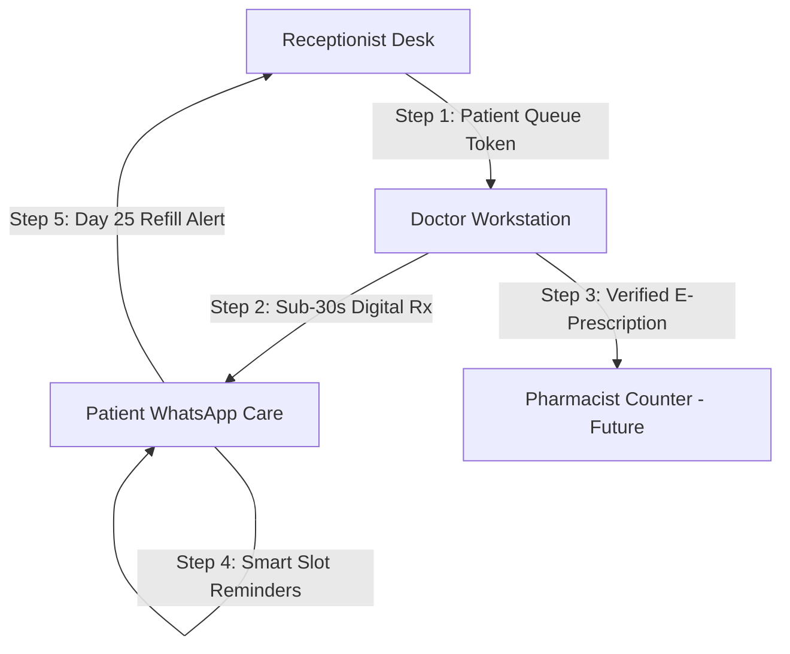

# 🩺 RxNXT — Master Feature Guide & Operational Playbook
> **The Complete Step-by-Step Clinical Guide, Technical Mechanics, and Value Matrix for Doctors, Patients, Receptionists, and Pharmacists**

---

## 📌 Executive Overview

**RxNXT** is a modern, cloud-hosted **Clinical Command Center and Patient Care Engine** built to make outpatient (OPD) healthcare fast, error-free, and continuous.

This playbook serves as the **Master Operational Guide** for RxNXT. It details every feature, step-by-step workflow, technical mechanics, and value proposition across all 4 key clinical stakeholders: **Doctors**, **Patients**, **Receptionists**, and **Pharmacists** *(Future Expansion Module)*.

---

## 👥 Stakeholder Value Matrix



| Stakeholder | Core Problem Solved | Key Features Used | Tangible Benefit / ROI |
| :--- | :--- | :--- | :--- |
| **🩺 Doctor** | Slow, tedious paper writing; handwriting misinterpretations; patient non-compliance. | Sub-30s Rx Engine, Fuzzy Drug Search, 1-Click Chips, History Cloning, Digital Signature. | **85% time savings** (under 30s per Rx); zero handwriting errors; protected doctor brand. |
| **👨‍👩‍👧 Patient** | Forgotten medicine times; lost paper prescriptions; dose confusion. | Instant WhatsApp PDF, Treatment Summary, 3-Window Smart Slot Nudges, Refill Alerts. | **Higher compliance & faster recovery**; 0 dosage confusion; direct access to PDF on WhatsApp. |
| **📋 Receptionist** | Waiting room chaos; registration errors; manual patient callouts. | Token Queue System, Auto-Reset Registration Form, Live Waiting Timers, Doctor Queue Status. | **70% fewer phone calls**; smooth, organized front-desk OPD flow. |
| **💊 Pharmacist** *(Future)* | Unreadable doctor handwriting; fake/tampered prescriptions; stock sync delays. | E-Prescription QR Scanner, Dispensing Verification, Live Stock Deduction. | **Zero dispensing errors**; 100% legal verification; automated inventory tracking. |

---

## 🔄 Step-by-Step Operational Workflows

### 📍 Workflow 1: Front-Desk Patient Onboarding & Queueing (Receptionist)

```
[Arrival] ➔ [Register Patient Form] ➔ [Check Consent] ➔ [Issue Token] ➔ [Auto-Reset Form]
```

1. **Patient Arrival**: Patient arrives at the clinic front desk.
2. **Registration (`/receptionist/dashboard`)**: Receptionist enters `Name`, `Phone`, `Age`, `Gender`, and `Address`.
3. **DPDP Act Consent**: Checkbox verifies explicit WhatsApp communication consent under India's Digital Personal Data Protection Act 2023.
4. **Token Generation**: Receptionist clicks **"Register & Add to Queue"**. A sequential token number (e.g. `Token #14`) is generated instantly.
5. **Auto-Reset Form**: The registration form **clears automatically within 0.5s**, readying the desk for the next waiting patient.
6. **Doctor Notification**: The patient appears live on the Doctor’s Dashboard under the **Patient Queue** panel with a waiting timer (*"Waiting for 2m"*).

---

### 📍 Workflow 2: Consultation & Sub-30-Second Prescription Generation (Doctor)

```
[Select Patient from Queue] ➔ [Review History] ➔ [Type Search / Quick Chips] ➔ [Save & Print / Send]
```

1. **Launch Consultation**: Doctor clicks **"Start Consultation"** on a waiting patient card in `/doctor/dashboard`.
2. **Review Past History**: Doctor clicks **"View History"** to review previous diagnosis, past prescriptions, or click **"Clone Prescription"** to re-issue repeat meds in 1 click.
3. **Chief Complaint & Diagnosis**: Doctor inputs quick clinical notes and diagnosis.
4. **Medicine Selection (Fuzzy Search)**:
   - Doctor types `"PCM"` or `"Paracetamol"`. The Fuse.js engine returns *Paracetamol 650mg* instantly (+100 pt alias bonus).
   - If a doctor frequently prescribes a drug, it appears at the top (+50 pt preference bonus).
5. **1-Click Dosage Chips**: Doctor taps 1-click pills instead of typing:
   - **Frequency**: `[1-0-1]` | `[1-1-1]` | `[1-0-0]` | `[0-0-1]` | `[SOS]`
   - **Duration**: `[3 Days]` | `[5 Days]` | `[7 Days]` | `[1 Month]`
   - **Meal Rule**: `[After meals]` | `[Before breakfast]` | `[At bedtime]`
6. **Save & Deliver**: Doctor clicks **"Review & Send via WhatsApp"**.
   - Client-side `jsPDF` generates the official PDF with clinic logo, doctor's MCI registration number, and digital signature.
   - Prescription is saved in Supabase Mumbai PostgreSQL in **under 50ms**.

---

### 📍 Workflow 3: Automated Smart-Slot Medication Adherence (Patient Care Engine)

```
[Prescription Saved] ➔ [Calculate Frequencies] ➔ [Schedule 3-Window Crons] ➔ [Deliver Targeted Nudges]
```

When a prescription is saved, RxNXT's Smart-Slot engine automatically categorizes medicines and schedules dispatches across 3 daily IST time windows:

```
🌅 8:00 AM IST (Morning Slot)
   • Filters: 1-0-0, 1-0-1, 1-1-1, OD, Before breakfast, Morning
   • Message: "🌅 Morning Dose Reminder... Take with water."

☀️ 1:30 PM IST (Afternoon Slot)
   • Filters: 0-1-0, 1-1-1, Afternoon, Thrice daily
   • Message: "☀️ Afternoon Dose Reminder... Take after lunch."

🌙 8:30 PM IST (Night Slot)
   • Filters: 0-0-1, 1-0-1, 1-1-1, Bedtime, Night, HS
   • Message: "🌙 Night Dose Reminder... Take after dinner/at bedtime."
```

#### 🛡️ Smart Slot Rules:
- **Zero Message Waste**: If a patient is prescribed *Aceclo (1-0-0)* (Morning only), it is **excluded from Afternoon and Night messages**.
- **Superseding Rule**: If a doctor modifies or re-issues a prescription for a patient on Wednesday, all old pending Monday reminders are automatically marked **`SUPERSEDED`** (cancelled). The patient receives **only 1 clean message** reflecting their latest active treatment!

---

### 📍 Workflow 4: Chronic Care Management & Day 25 Monthly Refill Alert

For chronic conditions (Diabetes, Hypertension, Thyroid, duration > 14 days):

1. **Days 1 to 14**: Patient receives a once-daily 8:00 AM IST morning health briefing.
2. **Day 25 Monthly Refill Alert**: The automated cron sends a targeted care alert:
   > *"🏥 Monthly Care & Refill Reminder: Hello Raj, you have approximately 5 days of your regular prescribed medications remaining. Please contact Dr. Shanmukha Datta at RxNXT Clinic to schedule your monthly checkup and refill."*
3. **Clinic ROI**: Patient schedules their monthly review, driving **predictable monthly OPD revenue** for the clinic.

---

### 📍 Workflow 5: Pharmacist E-Prescription Verification & Dispensing *(Future Module)*

```
[Patient Shows WhatsApp PDF/QR] ➔ [Pharmacist Scans QR] ➔ [RxNXT Verifies Authenticity] ➔ [Dispense & Deduct Stock]
```

1. **Patient Counter Arrival**: Patient presents their digital PDF or WhatsApp QR code at the clinic/partner pharmacy counter.
2. **QR Verification**: Pharmacist scans the QR code using the **RxNXT Pharmacist Terminal App**.
3. **Authenticity Check**: RxNXT verifies the cryptographic signature of the prescription against Supabase DB:
   - ✅ **Green Verified**: Displays genuine doctor signature, prescription date, and exact line items.
   - 🔴 **Red Alert**: Flags tampered or expired prescriptions (e.g. Schedule X / Narcotic re-use prevention).
4. **Dispense & Inventory Sync**: Pharmacist clicks **"Dispense Prescription"**. Stock counts automatically deduct from the clinic pharmacy inventory.

---

## 🔬 Feature Technical Mechanics Deep Dive

### 1. Intelligent Medicine Search Engine (`/api/drugs/search`)
- **Algorithm**: Additive Scoring + Fuse.js fuzzy engine.
- **Alias Short-Circuit**: `"PCM"` ➔ Paracetamol 650 (+100 pts).
- **Doctor Habit Preference**: Doctor frequently prescribes drug ➔ +50 pts.
- **Clinic Standardization**: Clinic featured drug catalog ➔ +20 pts.
- **Low Confidence Safeguard**: Score < 15 triggers *"Did you mean?"* warning banner in UI.

### 2. Client-Side PDF Renderer (`jsPDF`)
- Renders the complete PDF directly inside the doctor's web browser DOM.
- **Zero Server CPU Load**: 50,000 doctors rendering PDFs simultaneously consumes 0 server processing power.
- Encodes PDF as a Base64 stream for instant dispatch via WhatsApp microservice.

### 3. WhatsApp Microservice & Render Architecture
- **Microservice URL**: `https://rxnxt-whatsapp-service.onrender.com` (Render Paid $7 WebSockets).
- **Session Isolation**: Multi-file state storage (`v5_sessions_${clinicId}`) maintaining separate persistent WhatsApp WebSocket connections per clinic.
- **Rate-Limiting Safeguard**: Enforces a 1.2s to 1.5s delay between dispatches to maintain single-number safety under Meta anti-spam policies.

### 4. Admin Settings & Multi-Tenant Control (`/admin/settings`)
- **Clinic Profile**: Drag-and-drop clinic logo upload (`logoUrl`).
- **Doctor Profile**: MCI registration number and digital signature upload (`signatureUrl`).
- **Staff Onboarding**: Add/remove Doctors, Receptionists, Admins, and Nurses with NextAuth.js Role-Based Access Control (RBAC).

---

## 🟢 Summary

RxNXT connects the entire outpatient care chain into a unified digital workflow:

- **Receptionists** manage queue footfall effortlessly.
- **Doctors** write structured prescriptions in under 30 seconds.
- **Patients** stay compliant with 3-window Smart Slot WhatsApp nudges.
- **Pharmacists** *(Future)* verify digital authenticity and manage stock seamlessly.
