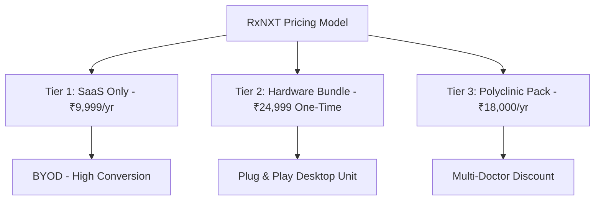

# 💼 RxNXT — Master Strategic Pricing & Revenue Blueprint
> **A Balanced, High-Margin Pricing Model Designed for Indian Healthcare Market Acceptance, High Conversion, and Lifetime Customer Retention**

---

## 📋 Executive Summary

Choosing the right pricing structure is the single most critical decision for **RxNXT’s market adoption and long-term profitability**.

In India, healthcare providers are **highly sensitive to upfront costs**, but they demonstrate **extraordinary loyalty** when pricing is transparent, fair, predictable, and directly tied to clear clinical ROI.

This document outlines the **Master 3-Tier "Price-Lock" Model** engineered to maximize doctor conversion rates, eliminate purchase friction, protect profit margins, and deliver long-term predictable recurring revenue.

---

## 🏆 The 3-Tier "Price-Lock" Model



### 🏷️ Tier Details & Structure

| Pricing Tier | Target Customer | Pricing Structure | Key Deliverables & Value Included |
| :--- | :--- | :--- | :--- |
| **Tier 1: BYOD SaaS Only** | Single Doctors with existing laptops/tablets | **₹999 / month** *(Monthly)*<br>OR **₹9,999 / year** *(Annual - Save 17%)* | 1-Year RxNXT SaaS access, unlimited PDF generation, Smart Slot WhatsApp reminders, cloud updates, basic support. |
| **Tier 2: Complete Tablet Bundle** | Doctors wanting a dedicated, zero-setup clinic device | **₹24,999 One-Time**<br>*(Renews at ₹9,999/yr from Year 2)* | Pre-configured 11-inch Android Tablet (Kiosk Mode), Heavy-Duty Desktop Stand, 1-Year RxNXT SaaS Subscription, onboarding. |
| **Tier 3: Polyclinic Multi-Doctor** | Small clinics & polyclinics (2 to 4 doctors) | **₹18,000 / year**<br>*(Effective ₹6,000/doctor/yr)* | Complete Multi-Doctor account, separate prescription queues, central receptionist portal, consolidated billing. |

---

## 🧠 Strategic Psychology & Market Alignment

### 1. The "2-Patient" Psychological Barrier
- In India, an average outpatient consultation fee is **₹300 to ₹500**.
- At **₹999 / month** (or ₹9,999 / year), the doctor pays for the entire monthly software subscription by writing **just 2 to 3 prescriptions a month**.
- **The Value Pitch**: *"Writing 3 prescriptions pays for RxNXT. The remaining 500 prescriptions written every month are 100% pure profit for your clinic."*

### 2. Eliminating Purchase Friction (BYOD vs Bundle)
- Doctors are never forced into an expensive upfront hardware purchase.
- If they already own a tablet or laptop, they start instantly at **₹9,999 / year**.
- If they want a dedicated, unbox-and-play device sitting on their desk, they select the **₹24,999 Bundle**.

### 3. The "Lifetime Price-Lock" Guarantee
- **The Rule**: Early adopters lock in their annual subscription rate for life.
- **The Promise**: *"As long as your annual subscription remains active, your renewal price will NEVER increase, even as we introduce new AI features."*
- **The Business Result**: Eliminates churn, builds deep trust, and drives massive word-of-mouth doctor referrals.

---

## 📊 Financial Projections & Unit Economics

### 💵 Unit Economics Breakdown (Hardware Bundle @ ₹24,999)

```text
┌────────────────────────────────────────────────────────┐
│ Selling Price to Doctor:                 ₹24,999       │
├────────────────────────────────────────────────────────┤
│ Less: Tablet Hardware Sourcing Cost    - ₹14,500       │
│ Less: Desktop Stand & Packaging         - ₹1,300       │
│ Less: Shipping, Gateway & Commission    - ₹2,700       │
├────────────────────────────────────────────────────────┤
│ = DAY 1 NET TAKE-HOME PROFIT:           ₹6,499 (26.0%) │
│ = YEAR 2 RENEWAL PROFIT (SaaS Only):   ₹11,500 (95.8%) │
└────────────────────────────────────────────────────────┘
```

---

### 📈 100-Clinic Revenue & Net Profit Simulation (Year 1)

Assuming a typical cohort of 100 onboarded clinics (70 BYOD SaaS + 30 Hardware Bundles):

| Customer Cohort | Volume | Unit Price | Total Revenue Generated |
| :--- | :---: | :---: | :---: |
| **BYOD SaaS Only Clinics** | 70 clinics | ₹9,999 | **₹6,99,930** |
| **Hardware Bundle Clinics** | 30 clinics | ₹24,999 | **₹7,49,970** |
| **TOTAL YEAR 1 GROSS REVENUE** | **100 Clinics** | — | **₹14,49,900** |
| **Less Hardware & Cloud Infrastructure Costs** | — | — | **-₹5,10,000** |
| **YEAR 1 NET PROFIT** | — | — | **₹9,39,900** *(64.8% Net Margin)* |

> 🚀 **Year 2 Renewal Value**: Billed at ₹9,999/year across 100 clinics = **₹9,99,900 / year recurring revenue at ~95% net margin**!

---

## 🟢 Strategic Summary

1. **Set SaaS Price at ₹9,999 / year** (₹999 / month).
2. **Offer Hardware Bundle at ₹24,999** as an optional convenience upgrade.
3. **Enforce the Lifetime Price Guarantee** to build an unshakeable doctor referral network.
